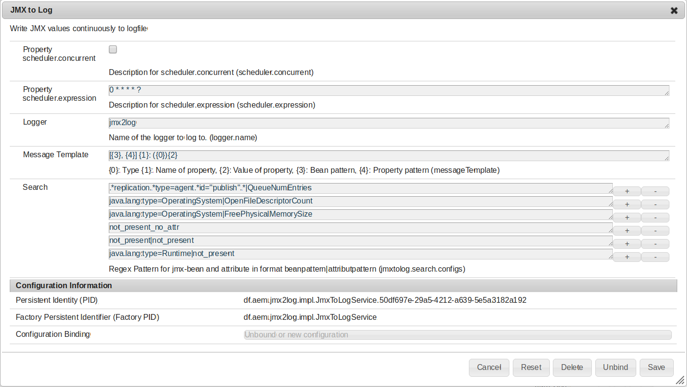
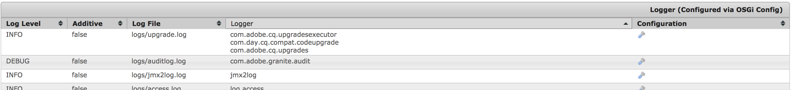
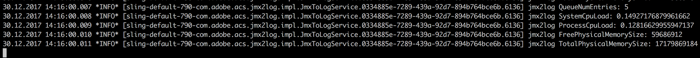

jmx2log
========

OSGi bundle with a service writing defined JMX values continuously to a logfile. Tested with AEM 6.0 and 6.3 / Apache Felix.

Release downloads
--------

[Releases](https://github.com/dfoerderreuther/jmx2log/releases)

Building
--------

This project uses Maven for building. Common commands:

    mvn clean install

Configuration
--------

The configuration of this bundle is twofold.
1. Configure at least one service of type df.aem.jmx2log.impl.JmxToLogService.
2. Configure Sling loggers to write the output of the configured JmxToLogServices to log files.

Service-Configuration
--------

Go to /system/console/configMgr and search for 'JMX to Log'. Create new service instances as needed. Each instance can be configured as follows:

**Property: scheduler.concurrent**

Enables concurrent running. Default is false. 

**Property: scheduler.expression**

Scheduling settings as cron expression. Defaults to once per minute.

**Property: Logger**

The name of the logger to log bean attributes to. All logging to this logger will be on level INFO.

(NB: Errors in configuration or problems with bean or attribute lookup will be logged to the class logger 'df.aem.jmx2log.impl.JmxToLogService'.)

**Property: Message Template**

This template will be used to create log messages. Defaults to '{1}: {2}'.

Arbitrary text can be specified as defined by [java.text.MessageFormat](https://docs.oracle.com/javase/8/docs/api/java/text/MessageFormat.html).
Following placeholders can be used:
- **{0}**: Type
- **{1}**: Name of property
- **{2}**: Value of property
- **{3}**: Bean pattern
- **{4}**: Property pattern (messageTemplate)

**Property: Search**

1..n Strings with JMX search patterns in format BEAN|ATTRIBUTE, BEAN and ATTRIBUTE being separate regular expressions.
(NB: Since the pipe character '|' is used to separate BEAN from ATTRIBUTE the pipe character must not be part of the regular expression matching BEAN.)

The service will search for a JMX bean with its canonical name matching the regular expression BEAN.
If ATTRIBUTE is omitted from a configuration line '.*' will be assumed, effectively matching *all* Attributes of *all* matching BEANs.
(NB: Since JMX beans can come and go at runtime the presence of BEAN and ATTRIBUTE will not be checked at configuration time but on every scheduled run of JmxToLogService.
Thus on every scheduled run regular expressions not matching any bean or attribute will be logged as a warning to 'df.aem.jmx2log.impl.JmxToLogService'. If BEAN and ATTRIBUTE do match but the retrieval of the corresponding value causes an exception this will be logged as an error.)

There is a Servlet giving an overview of accessible JMX-Beans and attributes (see below).

Logging
--------

Go to /system/console/slinglog and create an info logger for 'jmx2log'. If you chose to override the default name for the bridging logger use that name here.
Also add a file name and log level. Since all messages will be logged on level INFO you should choose this level as well.

Problems in configuration or lookup will be logged to 'df.aem.jmx2log.impl.JmxToLogService'. Add this category to your logging configuration when setting up the service.

Example Log output
---------

JMX-Dump-View Servlet
--------

The JMX-Dump-View Servlet exposes an overview of accessible JMX-Beans and attributes.
The servlet is reachable in the OSGi system console via 'Main -> JMX mBean dump'.

The direct link is /system/console/JMX-Dump
